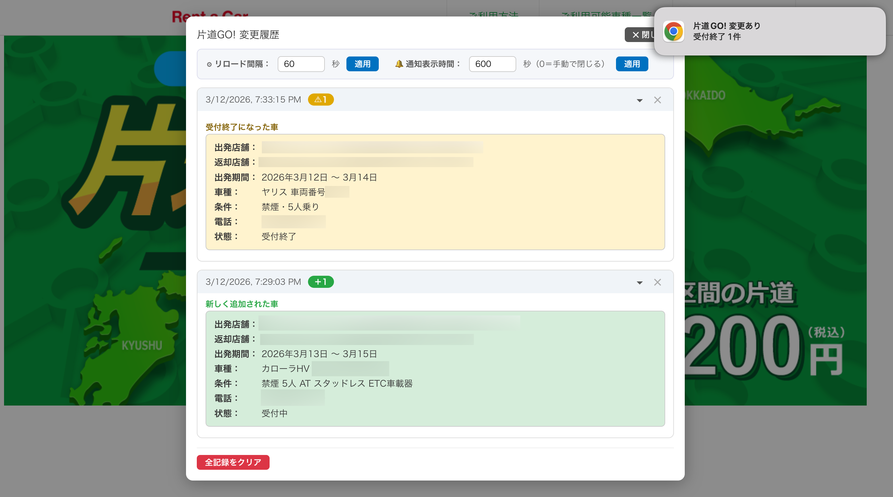

# KatamichiGO! (片道GO!) Monitor

A 100% vibe-coded Tampermonkey userscript that monitors the [片道GO!](https://cp.toyota.jp/rentacar/) listing page and alerts you when cars are added, removed, or closed for booking.

## Features

- Detects new listings, disappeared listings, and status changes
- Desktop notifications on change
- Persistent change history with per-car timeline
- Configurable auto-reload interval and notification display duration

## Installation

1. Install [Tampermonkey](https://www.tampermonkey.net/)
2. Open this [link](https://github.com/peashooterr/katamichigo-script/raw/main/KatamichiGO.user.js)
